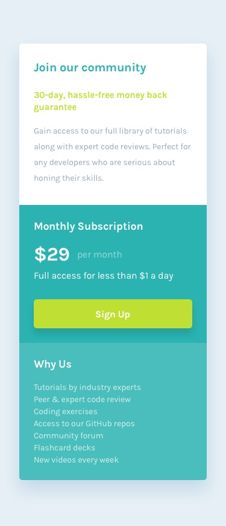

# Frontend Mentor - Single Price Grid Component Solution

[](https://github.com/Yashi-Singh-9/Single-Price-of-Grid-Component/


This is a solution to the [Single Price Grid Component challenge on Frontend Mentor](https://www.frontendmentor.io/challenges/single-price-grid-component-5ce41129d0ff452fec5abbbc). Frontend Mentor challenges help you improve your coding skills by building realistic projects.

---

## Table of Contents

- [Overview](#overview)
  - [The Challenge](#the-challenge)
  - [Screenshots](#screenshots)
  - [Links](#links)
- [Setup Instructions](#setup-instructions)
- [My Process](#my-process)
  - [Built With](#built-with)
  - [What I Learned](#what-i-learned)
  - [Continued Development](#continued-development)
  - [Useful Resources](#useful-resources)
- [Style Guide](#style-guide)
- [Author](#author)
- [Acknowledgments](#acknowledgments)

---

## Overview

### The Challenge

Users should be able to:

- View the optimal layout for the component depending on their device's screen size
- See a hover state on desktop for the Sign Up call-to-action

---

### Screenshots

#### Desktop Design


#### Mobile Design


---

### Links

- **Solution Repository**: [GitHub Repo](https://www.frontendmentor.io/solutions/single-price-grid-component-lp8pj_1Xmh)
- **Live Demo**: [GitHub Pages](https://yashi-singh-9.github.io/Single-Price-of-Grid-Component/)

---

## Setup Instructions

To run this project locally and use SCSS, follow these steps:

### Prerequisites

- Ensure you have [Node.js](https://nodejs.org/) installed.
- Install the SCSS preprocessor globally using npm:
  ```bash
  npm install -g sass
  ```

### Installation

1. Clone the repository:
   ```bash
   git clone https://github.com/Yashi-Singh-9/Single-Price-of-Grid-Component.git
   cd Single-Price-of-Grid-Component
   ```

2. Compile the SCSS file into CSS:
   ```bash
   sass styles.scss styles.css
   ```

3. Open the `index.html` file in your browser to view the project.

---

## My Process

### Built With

- **Semantic HTML5** markup
- **SCSS** (Sassy CSS)
- CSS **custom properties**
- **Flexbox**
- **CSS Grid**
- Mobile-first workflow

---

### What I Learned

This project provided a deeper understanding of responsive design and SCSS. Key takeaways include:

- Using **SCSS variables** to manage colors and theme consistency.
- Leveraging **Flexbox** and **CSS Grid** for layout creation.
- Adding smooth hover effects for buttons to improve interactivity.

Here’s an example of the SCSS hover effect I implemented:

```scss
button {
  background-color: $bright-yellow;
  color: #fff;
  border: none;
  transition: background-color 0.3s ease, transform 0.3s ease;

  &:hover {
    background-color: hsl(71, 73%, 64%);
    transform: scale(1.05);
  }
}
```

---

### Continued Development

Future areas of focus include:

- Exploring advanced SCSS features such as **mixins** and **functions**.
- Adding **JavaScript** for enhanced interactivity and dynamic behaviors.
- Improving accessibility (ARIA attributes, screen reader support).

---

### Useful Resources

- [CSS Tricks: A Guide to Flexbox](https://css-tricks.com/snippets/css/a-guide-to-flexbox/)
- [MDN Docs: CSS Grid](https://developer.mozilla.org/en-US/docs/Web/CSS/CSS_Grid_Layout)
- [Sass Official Documentation](https://sass-lang.com/documentation) 

---

## Style Guide

Refer to the detailed [Style Guide](style-guide.md) for color codes, typography, and spacing guidelines.

---

## Author

- LinkedIn: [Yashi Singh](https://www.linkedin.com/in/yashi-singh-b4143a246)
- Frontend Mentor: [@Yashi-Singh-9](https://www.frontendmentor.io/profile/Yashi-Singh-9)

---

## Acknowledgments

Special thanks to the **Frontend Mentor** team for creating such an engaging challenge. Huge appreciation to online communities and resources for constant learning and support.
